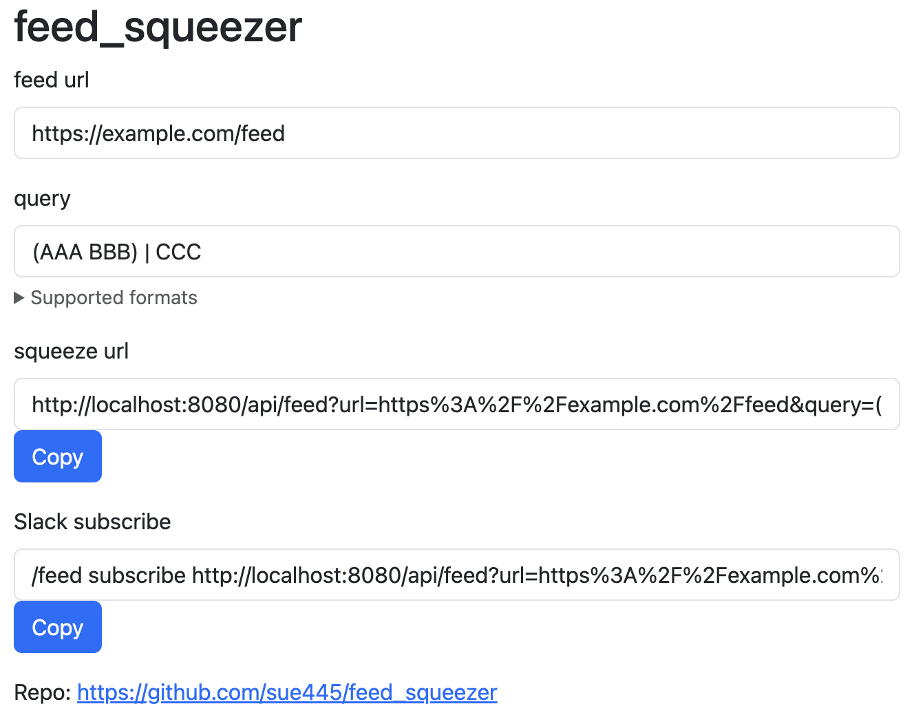

# feed_squeezer
_feed_squeezer_ returns a new feed squeezed by any keyword in feed

[](https://github.com/sue445/feed_squeezer/actions/workflows/test.yml)
[](https://github.com/sue445/feed_squeezer/actions/workflows/docker-ghcr.yml)
[](https://github.com/sue445/feed_squeezer/actions/workflows/docker-gcp.yml)

## Getting started
Run _feed_squeezer_ where it can be accessed from the Internet.

e.g.

### Docker
This application is provided as a Docker image, so you can run it wherever you like.

#### Images
* [GitHub Container Registry](https://github.com/sue445/feed_squeezer/pkgs/container/feed_squeezer) **(Recommended)**
  * `ghcr.io/sue445/feed_squeezer:latest`: Use latest version
  * `ghcr.io/sue445/feed_squeezer:vX.Y.Z`: Use specified version
* [Google Artifact Registry](https://console.cloud.google.com/artifacts/docker/feed-squeezer/us/feed-squeezer/app): If you want to run this app on [Cloud Run](https://cloud.google.com/run), use this image
  * `us-docker.pkg.dev/feed-squeezer/feed-squeezer/app:latest`: Use latest version
  * `us-docker.pkg.dev/feed-squeezer/feed-squeezer/app:vX.Y.Z`: Use specified version
  * `us-docker.pkg.dev/feed-squeezer/feed-squeezer/app:edge`: The contents of the main branch are pushed to this tag

### standalone binary
Download latest binary from https://github.com/sue445/feed_squeezer/releases

```bash
./feed_squeezer
```

### Build yourself
```bash
git clone https://github.com/sue445/feed_squeezer.git
cd feed_squeezer
make
./bin/feed_squeezer
```

open http://localhost:8080/

## Environment variables
* `PORT`(optional): http listening port. default is `8080`
* `SENTRY_DSN`, `SENTRY_RELEASE`, `SENTRY_ENVIRONMENT`(optional): [Sentry](https://sentry.io/) configuration. See followings
  * https://github.com/getsentry/sentry-go
  * https://docs.sentry.io/platforms/go/configuration/

## Cli usage
```bash
$ ./feed_squeezer --help
Usage of ./bin/feed_squeezer:
  -version
        Whether showing version
```

## Endpoint
### GET /
Display a simple form to generate _feed_squeezer_ URL



### GET /api/feed
returns a new feed squeezed by any keyword in feed

#### Parameters
All parameters must be URL encoded

* `url` : source feed url
* `query` : query to squeeze feed
  * The following formats are supported
  * `AAA BBB` : Includes all (AND search)
  * `AAA | BBB` : Includes any (OR search)
  * `(AAA BBB) | CCC`, `(AAA | BBB) CCC` : Evaluate conditions in brackets first

### GET /api/version
Returns app version (same to `feed_squeezer -version`)
